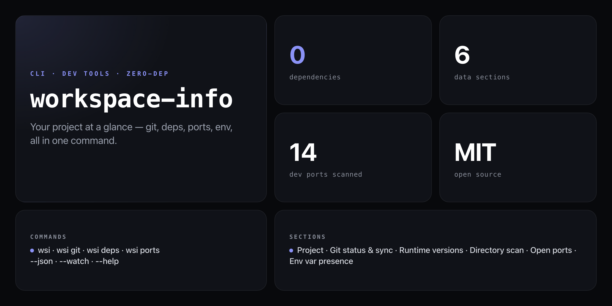

<div align="center">

**One command. Six data sections. Zero dependencies. Your whole workspace, instantly.**


</div>

---

You open a project you haven't touched in weeks. You need to know: what branch am I on? Is anything staged? Are my dev servers running? What env vars am I missing? `workspace-info` answers all of it in a single command, in under a second.

```
╭─────────────────────────── PROJECT ───────────────────────────╮
│  Name        my-app   v2.1.0   [MIT]
│  Description The next great thing
│  Type        module   pkg manager: pnpm
│  Deps        14 prod  42 dev  0 peer
│  Scripts     dev, build, test, lint, preview
╰────────────────────────────────────────────────────────────────╯

╭──────────────────────────── GIT ───────────────────────────────╮
│  Branch     main
│  Remote     origin/main  ✓ in sync
│  Changes    2 staged  1 unstaged  0 untracked
│  Last commit  3m ago  a1b2c3d  fix: resolve auth edge case
│  Author     Nick Ashkar
│  Origin     https://github.com/NickCirv/my-app.git
╰────────────────────────────────────────────────────────────────╯

╭─────────────────────────── RUNTIME ───────────────────────────╮
│  Node.js     v22.4.0
│  npm         10.8.1
│  bun         1.1.18
│  pnpm        9.4.0
│  git         2.45.2
│  Platform    darwin
╰────────────────────────────────────────────────────────────────╯

╭──────────────────────────── DIRECTORY ────────────────────────╮
│  Total files 247   Total size 4.2 MB
│  Largest files:
│    ▸ src/generated/schema.ts                       1.1 MB
│    ▸ public/assets/logo.png                        342 KB
│  Recently modified:
│    ▸ src/routes/auth.ts                            2m ago
│    ▸ src/middleware/session.ts                     5m ago
╰────────────────────────────────────────────────────────────────╯

╭──────────────────────────── OPEN PORTS ───────────────────────╮
│  ● 3000  Node/React/Next
│  ● 5173  Vite
╰────────────────────────────────────────────────────────────────╯

╭──────────────────────────── ENVIRONMENT ──────────────────────╮
│  NODE_ENV    development
│  .env files  .env  .env.local
│  Set vars    ✓ DATABASE_URL  ✓ JWT_SECRET  ✓ STRIPE_PUBLIC_KEY
╰────────────────────────────────────────────────────────────────╯

  Generated in 412ms · 9:41:22 AM
```

## Install

No npm account needed — runs straight from GitHub with zero dependencies:

```bash
npx github:NickCirv/workspace-info
```

Short alias `wsi` also works once you've run it once:

```bash
# Or install globally for persistent wsi shorthand
npm install -g github:NickCirv/workspace-info
```

## Usage

```bash
# Full workspace report (default)
npx github:NickCirv/workspace-info

# Sub-reports
npx github:NickCirv/workspace-info git       # git status + recent commits
npx github:NickCirv/workspace-info deps      # dependency breakdown
npx github:NickCirv/workspace-info ports     # full port scan

# Flags
npx github:NickCirv/workspace-info --json        # JSON output
npx github:NickCirv/workspace-info --watch       # refresh every 5 seconds
npx github:NickCirv/workspace-info --help        # show help

# Pipe JSON to jq
npx github:NickCirv/workspace-info --json | jq '.git'
```

| Command / Flag | What it does |
|---|---|
| `workspace-info` / `wsi` | Full workspace report (PROJECT, GIT, RUNTIME, DIRECTORY, PORTS, ENV) |
| `git` | Git-focused sub-report with last 5 commits |
| `deps` | Dependency breakdown — prod/dev/peer counts, lock file, node_modules status |
| `ports` | Full scan of 14 common dev ports, shows in-use vs free |
| `--json` | Output everything as machine-readable JSON |
| `--watch` / `-w` | Refresh every 5 seconds (live dashboard) |
| `--help` / `-h` | Show help |

## What gets scanned

| Section | Data |
|---|---|
| Project | name, version, description, license, dep counts, scripts |
| Git | branch, remote sync, staged/unstaged/untracked, last commit, stash count |
| Runtime | Node, npm, bun, pnpm, yarn, git versions, platform |
| Directory | file count, total size, top 5 largest files, 5 most recently modified |
| Open Ports | 14 common dev ports (3000, 5173, 8080, 4200, 8888, and more) |
| Environment | NODE_ENV, presence of 20+ common env vars, .env file detection |

Security note: env vars show **presence only** — values are never displayed or logged.

## What it is NOT

- **Not a project manager or task runner.** It reads your workspace state — it does not modify files, run builds, or install packages.
- **Not language-agnostic for all sections.** Project and Deps sections read `package.json`. Git, Runtime, Directory, and Ports work in any directory.
- **Not a secrets auditor.** It detects which env vars are set, not whether they're correctly scoped or rotated. For full git-history secret scanning, see [secret-scan](https://github.com/NickCirv/secret-scan).

---

<div align="center">
<sub>Zero dependencies · Node 18+ · MIT · by <a href="https://github.com/NickCirv">NickCirv</a></sub>
</div>
